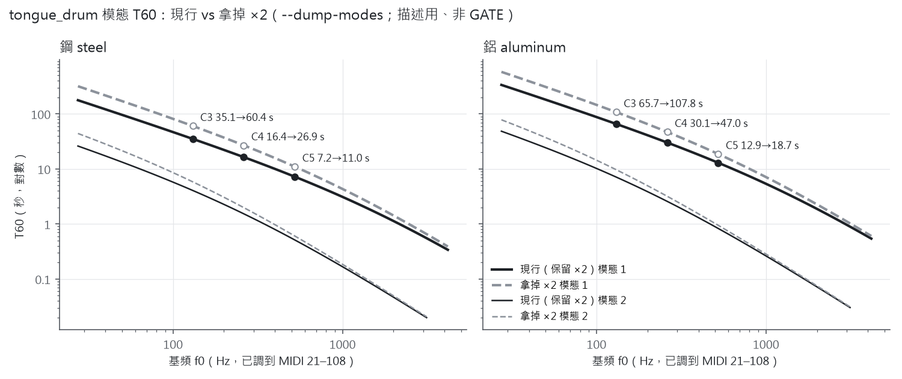
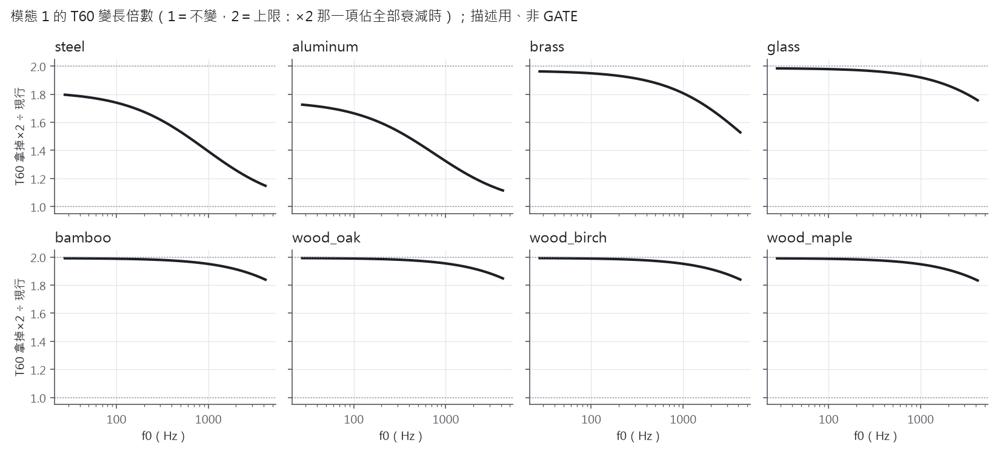
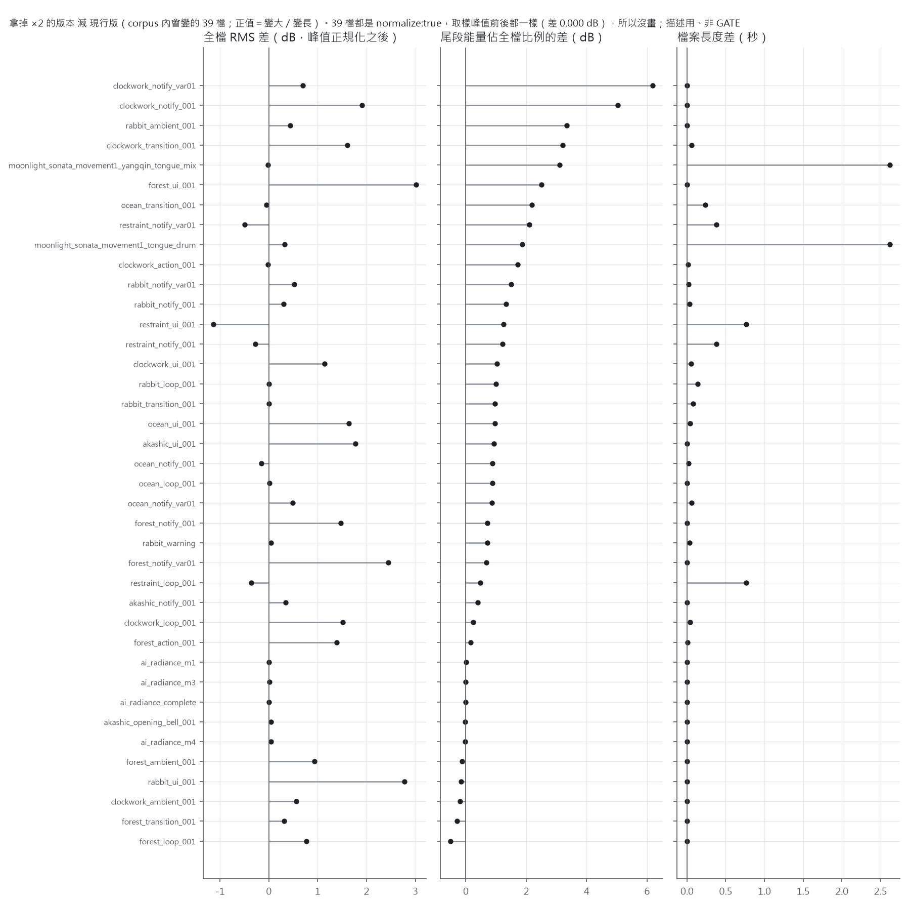
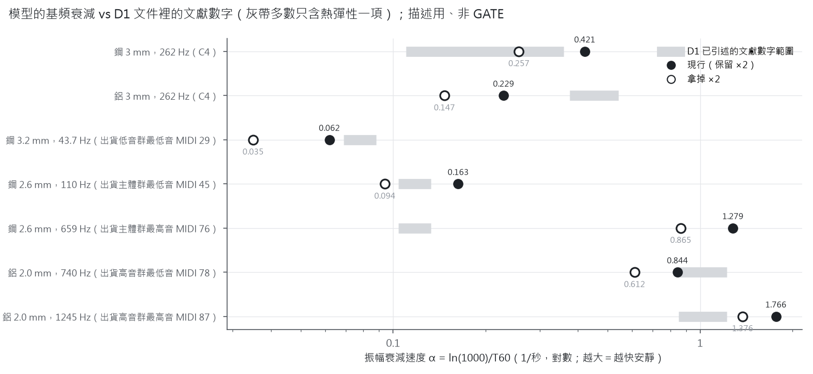

# 舌鼓 BeamModel 的「×2 阻尼」拿掉之後會差多少（裁決包 Q17 選項 D 的「先算數字」；R10 式前後對照）

> 卡號：WF0925b-BR（研究 lane）　日期：2026-09-25　HEAD 18430c4＋WF0925 staged 樹（index tree `ef4ce1ce…`）
> **本卡沒有改主工作樹的任何程式、沒有改任何樂譜、沒有動任何商品檔。** 「拿掉 ×2」只做在 `output/wf0925b/BR/tree/`（gitignored 的隔離副本）裡，建出一支實驗用 CLI 來比數字。
> **全文的數字都是「描述用、非 GATE」**：沒有新增任何容差或判定門檻（R2）；文獻數字只用 `docs/D1_BEAM_PLATE_DAMPING_SEARCH.zh-TW.md` 已經逐字引述過的（R4），不新增來源。
> **本文不替月月選 A／B／C。** 只把「如果選 B，會變成什麼樣」算清楚。
> 證據：`reports/gate_outputs/wf0925b_BR_*.txt`（6 檔）；資料、圖、腳本：`reports/beam_x2_option_b/`。

---

## §0 先看這裡（白話結論）

1. **拿掉 ×2 只動一行**：`src/physics/BeamModel.h:53-54` 的 `internalFrictionRate(...) * 2.0f` 改成不乘 2。隔離建出兩支 CLI——「現行」（不改）和「拿掉 ×2」。
   現行那支渲染 8 首位元不變基準 **8/8 IDENTICAL**，證明隔離副本＝staged 樹。
2. **舌鼓的每個模態都會響得更久，倍數在 1 到 2 之間**：
   - 鋼：基頻 T60 變成 **1.15～1.80 倍**（低音變最多、高音變最少）。C3 35.1→60.4 s、C4 16.4→26.9 s、C5 7.2→11.0 s（跟 D1 §3.1 的數字逐位相同）。
   - 鋁：1.11～1.73 倍。C4 30.1→47.0 s。
   - 黃銅、玻璃、竹、木頭這類「材料損耗本來就大」的：幾乎整條都接近 **2 倍**（1.5～2.0）。
   - 頻率完全不變（兩支 CLI 的 `--dump-modes` 頻率逐一相同）。
3. **75 份 corpus 裡有 39 份會變（兩支 CLI 渲染 sha 39/39 不同），其餘 36 份逐位元相同（36/36）**。
   8 首位元不變基準裡會變的是 **3 首**：月光空靈鼓版、月光揚琴＋空靈鼓混合版、AI Radiance 第 1 樂章。
4. **商品 clean_batch2 的 50 件裡，36 件會變**（音效庫 32 件＋AI Radiance 4 件；清單在 §3.4）。
   現行 CLI 能**逐位元重現全部 50 件母帶**（sha 跟 `masters/` 相同，50/50）；拿掉 ×2 之後那 36 件全都不同，另外 14 件照樣相同。
5. **聲音會怎麼變（只描述數字，不是耳驗）**：會變的 39 檔全都有峰值正規化（`normalize: true`），所以峰值不變；變的是「放開之後的尾巴」——尾段能量佔全檔比例最多 **+6.2 dB**（clockwork 通知音），全檔 RMS 在 −1.1～+3.0 dB 之間，檔案最多變長 0.77 秒（音效）／2.6 秒（月光）。
6. **physics_verify --full 兩版都是 NO CHECKED FAILURES，沒有任何一條從 PASS 變 FAIL**。但要注意：裡面跟衰減有關的檢查，都是在比「渲染出來的聲音」跟「模型自己說的數字」一不一致，模型是 ×1 還是 ×2 都會照樣過——**這種 GATE 不能證明哪一版比較接近真的舌鼓**。
7. **對照文獻（只用 D1 已引述的數字）**：7 個對照點裡，現行 0 個、拿掉 ×2 只有 1 個落在 D1 的文獻數字範圍內；兩版都是「有的點偏高、有的點偏低」，沒有一版整體一致地偏向哪一邊。
   鋼 C4：拿掉 ×2（0.257 /s）落在 D1 的已知機制合計 0.11～0.36 /s 裡、現行（0.421 /s）高於上緣——但 D1 自己說缺的兩塊（支撐、窄條輻射）只會往上加。
   鋁 C4：兩版（0.229、0.147 /s）都**低於**光熱彈性一項（0.376～0.541 /s），拿掉 ×2 離得更遠。
   模型的衰減不看舌片厚度，文獻看；這件事 ×1、×2 都表達不了（D1 §3.4）。

---

## §1 做了什麼、怎麼做

### 1.1 程式裡 ×2 在哪、影響哪些路徑

- `src/physics/BeamModel.h:50-58` `decayTimeForFrequency()`：`1/T60 = internalFrictionRate(eta, f) * 2.0f + beam_plate_beta_air·f² + beam_plate_gamma_radiation·f`，
  其中 `internalFrictionRate = eta·f/2.2`（`MaterialDB.h:83,90-93`）。**`* 2.0f` 在第 54 行**。
- 誰會呼叫它：`src/engines/ChromaticEngine.h:703-709` 的 `decayTimeForMode()`，只有 `subEngine == 0`（Tongue Drum）走 BeamModel；水鑼（1）與 Custom Harmonics（2）走 `PlateModel`，不受影響。
  - score／CLI 路徑：`ChromaticEngine.h:353-355`（調到 MIDI 之後，用發聲頻率重算）。
  - 外掛路徑：`ChromaticEngine.h:216-221`（再乘巨集旋鈕 `matScale·dmpScale`）。本卡沒建外掛、沒量外掛（§7）。
  - score 裡寫 `"engine": "beam"` 或 `"tongue_drum"` 都是這顆引擎（`ScoreRenderer.h` 渲染路徑 `:1132`、`:1510`；`--dump-modes` 路徑 `:337`、`:345`）。
- **連帶會動的東西**（程式碼本來就這樣接，不是本卡加的）：
  - 跨音域響度補償 `ModalResonator::loudnessCompensationGain()` 會讀各模態的 T60 算「前 0.3 秒的攻擊能量」（`ChromaticEngine.h:244-252`、`:372-380`）。T60 變長 → 攻擊能量變大 → 補償增益變小，所以**整顆音的振幅會小一點**（§2.3）。
  - 渲染長度 `ScoreRenderer.h:1559-1587` `eventEndTime()` 用「最長的模態 T60」決定事件要算多久，所以**檔案會變長**（§3.2）。
  - 放開（note-off，發生在 `duration` 的 90%）之後的衰減時間是 `0.08 × T60`（`ChromaticEngine.h:414-419` 呼叫 `ModalResonator.h:107-117` 的 `damp(0.08)`），所以 T60 變長時，**放開之後的尾巴也等比例變長**。這是短音效也會變的原因。

### 1.2 隔離建置（照 WF0925-F5 的安全做法）

| 步驟 | 內容 |
|---|---|
| 快照 | `git write-tree`（只寫 tree object，不動 index／refs）→ `ef4ce1ce…`；`git archive` 解到 `output/wf0925b/BR/tree/` |
| JUCE | 副本的 `libs/JUCE` 是空資料夾 → `rmdir`（非遞迴）→ `mklink /J` 指向主 repo 的 `libs/JUCE` |
| 建置 | `GIT_CEILING_DIRECTORIES` 設在副本外，只建 `TsukiSynthCLI`；base 與 noX2 各一次，`warning C`／`error C` 都 0 行 |
| 唯一改動 | 副本裡 `BeamModel.h` 第 54 行刪掉 ` * 2.0f`（diff 全文在證據 1） |
| 證明副本＝staged 樹 | 改之前 `diff -r src tree/src` 完全相同；base CLI 渲染 8 首基準 **8/8 IDENTICAL**（證據 2） |
| 安全 | 主 repo `libs/JUCE` 開工時 4378 個檔（全部項目 4963）、收工時一樣 4378／4963，JUCE 自己的 `git status` 乾淨（證據 6）；junction 收尾時只用 `cmd //c rmdir` 刪連結本身，沒有遞迴刪除 |

兩支 CLI：base `cc2b0e1a…`、noX2 `760fde2d…`（跟 `build\` 的 `b84c775b…` 位元組不同，是因為 exe 內嵌 git 出處資訊；聲音相同已由 8/8 證明）。

---

## §2 舌鼓模態 T60：全音域前後對照（`--dump-modes`）

### 2.1 量法

- 探針：14 種材料 × MIDI 21–108（88 個音）× 每顆音所有可渲染模態，共 7,000 列（`reports/beam_x2_option_b/t60_sweep.csv`）。
- 探針幾何用出貨月光空靈鼓版的主體群（2.6 mm／24 mm／100 mm／strike 0.44）；**調到 MIDI 之後，T60 只看「頻率＋材料」，幾何不影響 T60**（只影響振幅與哪些模態被 20 kHz 濾掉），D1 §1 已說明。
- 核對：兩支 CLI dump 出來的 T60 跟 `BeamModel.h` 公式（base 用 ×2、noX2 用 ×1）相對差最大 **5.0×10⁻⁵**，就是 dump 的列印精度；拿 base 去套 ×1 公式差 **0.50**——證明兩支 CLI 真的只差這一個倍數（證據 3）。

### 2.2 鋼與鋁的基頻（模態 1）



| 材料 | MIDI | 基頻 Hz | 現行 T60 | 拿掉 ×2 | 倍數 | ×2 那一項佔現行衰減的比例 |
|---|---|---|---|---|---|---|
| 鋼 | 29（出貨最低音） | 43.7 | 110.6 s | 197.2 s | 1.78 | 43.9% |
| 鋼 | 45 | 110.0 | 42.28 s | 73.25 s | 1.73 | 42.3% |
| 鋼 | 48（C3） | 130.8 | 35.15 s | 60.38 s | 1.72 | 41.8% |
| 鋼 | 60（C4） | 261.6 | 16.39 s | 26.86 s | 1.64 | 39.0% |
| 鋼 | 72（C5） | 523.3 | 7.22 s | 11.00 s | 1.52 | 34.4% |
| 鋼 | 76 | 659.3 | 5.40 s | 7.98 s | 1.48 | 32.4% |
| 鋼 | 84（C6） | 1046.5 | 2.92 s | 4.04 s | 1.38 | 27.8% |
| 鋼 | 108（C8） | 4186.0 | 0.339 s | 0.390 s | 1.15 | 12.9% |
| 鋁 | 60（C4） | 261.6 | 30.14 s | 46.97 s | 1.56 | 35.8% |
| 鋁 | 78 | 740.0 | 8.18 s | 11.29 s | 1.38 | 27.5% |
| 鋁 | 87 | 1244.5 | 3.91 s | 5.02 s | 1.28 | 22.1% |

- 「×2 那一項佔現行衰減的比例」＝拿掉 ×2 等於把現行衰減速度砍掉多少；倍數 = 1 ÷ (1 − 比例)。
- 鋼的 C3／C4／523 Hz／1046 Hz／4186 Hz 五個數字跟 D1 §3.1 逐位相同（D1 是公式推算，本卡是 CLI 實際 dump）。
- 第 2 模態（6.27 倍頻）也一樣變長，但倍數比較小（鋼 C4 的第 2 模態 1640 Hz：1.53→1.98 s，1.30 倍），因為高頻時 `beta_air·f²` 那一項比較大。

### 2.3 其他材料（corpus 有用到的 8 種）



| 材料 | 基頻 T60 倍數（MIDI 21–108） | 全部模態的倍數 | 基頻振幅（補償增益）變化 |
|---|---|---|---|
| steel 鋼 | 1.148～1.796 | 1.036～1.796 | −0.68～0.00 dB |
| aluminum 鋁 | 1.115～1.725 | 1.028～1.725 | −0.45～−0.06 dB |
| brass 黃銅 | 1.528～1.962 | 1.196～1.962 | −1.91～0.00 dB |
| glass 玻璃 | 1.757～1.984 | 1.405～1.984 | −2.13～0.00 dB |
| bamboo 竹 | 1.839～1.991 | 1.531～1.991 | −2.30～0.00 dB |
| wood_oak | 1.848～1.992 | 1.547～1.992 | −2.31～0.00 dB |
| wood_birch | 1.840～1.992 | 1.532～1.992 | −2.31～0.00 dB |
| wood_maple | 1.833～1.991 | 1.521～1.991 | −2.30～0.00 dB |

（14 種材料全表在證據 3；bronze、copper、iron、spruce、nylon、rubber 也都在 1.1～2.0 倍之間。）

- **為什麼有的接近 2 倍、有的不到**：×2 乘的是「材料內部摩擦」那一項。材料損耗本來就大的（黃銅、玻璃、木頭），這一項幾乎就是全部，拿掉 ×2 就接近 2 倍；鋼、鋁的材料損耗很小，另外兩項（空氣、輻射）比重大，所以倍數小，而且越高音越小。
- **振幅為什麼會變小**：§1.1 的響度補償。T60 變長 → 前 0.3 秒的能量變大 → 補償增益 `(ref/E)^0.39` 變小。0.00 dB 的格子是補償增益兩版都被 `jlimit(0.25, 4.0)` 夾在上下限（沒被夾住的話，T60 一變增益一定跟著變）。
- **補償錨點**：`kChromaticAttackEnergyRefA4[0] = 0.009504`（`ChromaticEngine.h:24-36`）是在 ×2 時代量的。noX2 版沒有重量這個錨點（本卡只准拿掉 ×2），所以錨點條件（A4／鋁／strike 0.3／預設幾何）的增益從 1 變成 **−0.141 dB**（證據 3 最後）。如果將來真的選 B，要不要重量錨點是 B 自己的子題（重量的話，沒被夾住的音會再整體 +0.14 dB 左右，又是一次 R10 變動）。

---

## §3 corpus 與商品

### 3.1 誰會變

- 75 份 corpus（`verify_score.py --all` 的四個根目錄）裡，**39 份**有舌鼓事件（直接寫 `beam`／`tongue_drum`，或透過 `layers` 疊進來的——只有 `ai_radiance_complete` 是後者），共 2,516 個舌鼓事件。
- **39/39 渲染 sha 全部改變**；另外 36 份沒有舌鼓的 corpus，兩支 CLI 渲染結果**逐位元相同**（證據 4 的 non-beam 段）。
- 混合檔裡的非舌鼓事件（例如月光混合版的 1142 個揚琴事件）：兩版 `--dump-modes` 逐字相同，1443/1443（證據 4）。
- corpus 以外還有 6 份用到舌鼓（`scores/tests/` 5 份、`scores/originals/rules_v2_demo/` 1 份），本卡只列出、沒有渲染（清單在 `beam_usage_all_scores.csv`）。

### 3.2 逐檔前後差



欄位說明：
- **模態 1 T60**：`--dump-modes` 每個舌鼓事件的最低模態，取整檔中位數；倍數是整檔最小～最大。
- **振幅變化**：同一事件所有模態共用的補償增益變化（§2.3）。
- **全檔 RMS 差**：39 檔的 `export.normalize` 全部是 `true`（峰值正規化），所以**取樣峰值兩版 39/39 完全相同**（差 0.000 dB），RMS 差是正規化之後的。
- **尾段佔比差**：「最後一個音放開之後（time＋0.9×duration，渲染器自己的放開規則）到檔尾」的能量佔全檔能量的比例，前後差多少 dB。這個量**不受正規化影響**。ai_radiance 幾首的舌鼓不在曲尾，所以這欄接近 0。
- **檔長差**：`eventEndTime()` 用最長 T60 決定事件長度，所以檔案可能變長。

| # | score | 舌鼓事件 | 材料 | 事件長度（秒） | 模態 1 T60 中位數：現行→拿掉 | 變長倍數（最小～最大） | 模態 1 振幅（補償增益）變化 dB | 全檔 RMS 差 dB | 尾段佔比差 dB | 檔長差 秒 | 商品 id |
|---|---|---|---|---|---|---|---|---|---|---|---|
| 1 | `examples/moonlight_sonata_movement1_tongue_drum` | 1142 | aluminum×14、steel×1128 | 1.8～13.44 | 15.35 → 25.02 s | 1.2841～1.7828 | -0.377～-0.169 | +0.320 | +1.866 | +2.618 | — |
| 2 | `examples/moonlight_sonata_movement1_yangqin_tongue_mix` | 1142 | aluminum×14、steel×1128 | 2.4～13.44 | 15.35 → 25.02 s | 1.2841～1.7828 | -0.377～-0.169 | -0.016 | +3.104 | +2.618 | — |
| 3 | `examples/rabbit_warning` | 2 | aluminum×2 | 0.4～0.4 | 3.172 → 4.001 s | 1.2445～1.2739 | -0.390～-0.350 | +0.044 | +0.711 | +0.034 | — |
| 4 | `originals/ai_radiance/ai_radiance_complete` | 64 | bamboo×16、glass×40、steel×8 | 0.27～1.198 | 0.6701 → 1.284 s | 1.4317～1.9630 | -1.915～+0.000 | +0.006 | -0.006 | +0.000 | ai_radiance_complete |
| 5 | `originals/ai_radiance/ai_radiance_m1` | 16 | glass×8、steel×8 | 0.648～0.648 | 2.476 → 3.786 s | 1.4317～1.9355 | +0.000～+0.000 | +0.005 | +0.002 | +0.000 | ai_radiance_m1 |
| 6 | `originals/ai_radiance/ai_radiance_m3` | 16 | bamboo×16 | 1.198～1.198 | 0.1123 → 0.2192 s | 1.9384～1.9630 | +0.000～+0.000 | +0.008 | +0.000 | +0.000 | ai_radiance_m3 |
| 7 | `originals/ai_radiance/ai_radiance_m4` | 32 | glass×32 | 0.27～0.492 | 0.6701 → 1.284 s | 1.8952～1.9383 | -1.915～+0.000 | +0.041 | -0.032 | +0.000 | ai_radiance_m4 |
| 8 | `library/akashic/akashic_notify_001` | 2 | glass×2 | 1.2～1.5 | 0.4578 → 0.8648 s | 1.8743～1.8998 | -2.120～-2.117 | +0.339 | +0.395 | +0.000 | akashic_notify_001 |
| 9 | `library/akashic/akashic_opening_bell_001` | 7 | steel×7 | 3.5～5 | 8.926 → 13.88 s | 1.4784～1.6220 | -0.181～+0.000 | +0.047 | -0.020 | +0.000 | akashic_opening_bell_001 |
| 10 | `library/akashic/akashic_ui_001` | 1 | glass×1 | 0.3～0.3 | 0.3232 → 0.5999 s | 1.8561～1.8561 | -2.091～-2.091 | +1.774 | +0.935 | +0.000 | akashic_ui_001 |
| 11 | `library/clockwork/clockwork_action_001` | 1 | brass×1 | 0.2～0.2 | 1.995 → 3.799 s | 1.9046～1.9046 | -1.625～-1.625 | -0.017 | +1.718 | +0.011 | clockwork_action_001 |
| 12 | `library/clockwork/clockwork_ambient_001` | 6 | brass×6 | 0.05～0.05 | 0.9645 → 1.784 s | 1.8496～1.8496 | -1.581～-1.581 | +0.561 | -0.191 | +0.000 | clockwork_ambient_001 |
| 13 | `library/clockwork/clockwork_loop_001` | 10 | brass×10 | 0.05～0.08 | 0.9645 → 1.784 s | 1.7666～1.8496 | -1.828～-1.581 | +1.516 | +0.251 | +0.041 | clockwork_loop_001 |
| 14 | `library/clockwork/clockwork_notify_001` | 1 | brass×1 | 1～1 | 1.026 → 1.903 s | 1.8554～1.8554 | -1.613～-1.613 | +1.907 | +5.035 | +0.000 | clockwork_notify_001 |
| 15 | `library/clockwork/clockwork_notify_var01` | 1 | brass×1 | 1～1 | 1.026 → 1.903 s | 1.8554～1.8554 | -1.613～-1.613 | +0.693 | +6.191 | +0.000 | clockwork_notify_var01 |
| 16 | `library/clockwork/clockwork_transition_001` | 4 | brass×4 | 0.25～0.4 | 1.944 → 3.699 s | 1.8763～1.9195 | -1.666～-1.566 | +1.605 | +3.211 | +0.057 | clockwork_transition_001 |
| 17 | `library/clockwork/clockwork_ui_001` | 1 | brass×1 | 0.06～0.06 | 1.159 → 2.163 s | 1.8664～1.8664 | -1.562～-1.562 | +1.137 | +1.037 | +0.050 | clockwork_ui_001 |
| 18 | `library/forest/forest_action_001` | 2 | wood_oak×2 | 0.08～0.12 | 0.217 → 0.4298 s | 1.9777～1.9830 | -2.302～-0.302 | +1.384 | +0.159 | +0.008 | forest_action_001 |
| 19 | `library/forest/forest_ambient_001` | 6 | bamboo×6 | 1.5～1.8 | 0.09976 → 0.1943 s | 1.9321～1.9595 | +0.000～+0.000 | +0.929 | -0.130 | +0.000 | forest_ambient_001 |
| 20 | `library/forest/forest_loop_001` | 16 | bamboo×16 | 0.8～0.8 | 0.1055 → 0.2057 s | 1.9321～1.9613 | +0.000～+0.000 | +0.763 | -0.518 | +0.000 | forest_loop_001 |
| 21 | `library/forest/forest_notify_001` | 2 | bamboo×2 | 0.4～0.5 | 0.04622 → 0.08799 s | 1.8899～1.9136 | -2.198～-2.156 | +1.472 | +0.713 | +0.000 | forest_notify_001 |
| 22 | `library/forest/forest_notify_var01` | 3 | bamboo×3 | 0.2～0.3 | 0.03928 → 0.07424 s | 1.8666～1.8899 | -2.156～+0.000 | +2.447 | +0.678 | +0.000 | forest_notify_var01 |
| 23 | `library/forest/forest_transition_001` | 4 | wood_birch×4 | 1～1.5 | 0.1106 → 0.2173 s | 1.9567～1.9686 | +0.000～+0.000 | +0.315 | -0.286 | +0.000 | forest_transition_001 |
| 24 | `library/forest/forest_ui_001` | 1 | wood_oak×1 | 0.1～0.1 | 0.09672 → 0.1901 s | 1.9658～1.9658 | -2.287～-2.287 | +3.013 | +2.510 | +0.000 | forest_ui_001 |
| 25 | `library/ocean/ocean_loop_001` | 2 | glass×2 | 0.3～0.3 | 0.8522 → 1.645 s | 1.9267～1.9327 | +0.000～+0.000 | +0.015 | +0.873 | +0.000 | ocean_loop_001 |
| 26 | `library/ocean/ocean_notify_001` | 1 | glass×1 | 0.3～0.3 | 0.6701 → 1.284 s | 1.9162～1.9162 | +0.000～+0.000 | -0.150 | +0.883 | +0.020 | ocean_notify_001 |
| 27 | `library/ocean/ocean_notify_var01` | 1 | glass×1 | 0.5～0.5 | 1.365 → 2.662 s | 1.9496～1.9496 | -1.627～-1.627 | +0.489 | +0.862 | +0.060 | ocean_notify_var01 |
| 28 | `library/ocean/ocean_transition_001` | 1 | aluminum×1 | 2～2 | 11.14 → 15.85 s | 1.4230～1.4230 | -0.178～-0.178 | -0.051 | +2.189 | +0.235 | ocean_transition_001 |
| 29 | `library/ocean/ocean_ui_001` | 1 | glass×1 | 0.15～0.15 | 0.8016 → 1.544 s | 1.9267～1.9267 | +0.000～+0.000 | +1.640 | +0.967 | +0.037 | ocean_ui_001 |
| 30 | `library/rabbit/rabbit_ambient_001` | 5 | aluminum×5 | 2～2.5 | 3.588 → 4.571 s | 1.2259～1.3153 | +0.000～+0.000 | +0.441 | +3.343 | +0.000 | rabbit_ambient_001 |
| 31 | `library/rabbit/rabbit_loop_001` | 8 | aluminum×8 | 0.2～0.3 | 5.039 → 6.628 s | 1.2739～1.3690 | -0.350～-0.231 | +0.004 | +0.993 | +0.139 | rabbit_loop_001 |
| 32 | `library/rabbit/rabbit_notify_001` | 1 | aluminum×1 | 0.8～0.8 | 2.757 → 3.431 s | 1.2445～1.2445 | -0.391～-0.391 | +0.299 | +1.338 | +0.033 | rabbit_notify_001 |
| 33 | `library/rabbit/rabbit_notify_var01` | 1 | steel×1 | 0.6～0.6 | 1.635 → 2.132 s | 1.3040～1.3040 | -0.650～-0.650 | +0.516 | +1.499 | +0.019 | rabbit_notify_var01 |
| 34 | `library/rabbit/rabbit_transition_001` | 3 | aluminum×3 | 0.5～0.6 | 3.588 → 4.571 s | 1.2259～1.3153 | -0.415～-0.294 | +0.004 | +0.971 | +0.079 | rabbit_transition_001 |
| 35 | `library/rabbit/rabbit_ui_001` | 1 | wood_maple×1 | 0.15～0.15 | 0.1017 → 0.1987 s | 1.9536～1.9536 | -2.267～-2.267 | +2.773 | -0.163 | +0.000 | rabbit_ui_001 |
| 36 | `library/restraint/restraint_loop_001` | 4 | steel×4 | 0.15～0.15 | 22.64 → 37.95 s | 1.6621～1.6763 | -0.571～-0.552 | -0.356 | +0.479 | +0.766 | restraint_loop_001 |
| 37 | `library/restraint/restraint_notify_001` | 2 | steel×2 | 0.2～0.3 | 10.16 → 16.03 s | 1.5342～1.6041 | -0.610～-0.495 | -0.273 | +1.207 | +0.379 | restraint_notify_001 |
| 38 | `library/restraint/restraint_notify_var01` | 2 | steel×2 | 0.2～0.3 | 10.16 → 16.03 s | 1.5342～1.6041 | -0.610～-0.495 | -0.500 | +2.102 | +0.379 | restraint_notify_var01 |
| 39 | `library/restraint/restraint_ui_001` | 1 | steel×1 | 0.08～0.08 | 22.64 → 37.95 s | 1.6763～1.6763 | -0.552～-0.552 | -1.135 | +1.245 | +0.766 | restraint_ui_001 |

**怎麼讀**：
- **月光空靈鼓版**（1142 個音、鋼為主）：基頻 T60 中位數 15.35→25.02 s；檔案長 2.6 秒；尾段佔比 +1.9 dB；全檔 RMS（正規化後）+0.32 dB。混合版因為揚琴不變、舌鼓的尾巴拉長，尾段佔比 +3.1 dB。
- **木頭／竹／玻璃／黃銅的短音效**：T60 幾乎翻倍（1.8～2.0 倍），但本來就只有 0.04～2 秒；放開後的尾巴也翻倍（§1.1），正規化後 RMS 最多 +3.0 dB（forest_ui_001）。
- **restraint 系列（鋼、低音區）**：T60 本來就 10～23 秒、拿掉 ×2 變 16～38 秒；事件都很短（0.08～0.3 秒），所以主要是檔案變長 0.4～0.8 秒、全檔 RMS 被更長的檔拉低（−0.3～−1.1 dB）。
- 原始數字：`corpus_beam_before_after.csv`（sha、長度、RMS、峰值、尾段能量）、`corpus_beam_tail_share.csv`、`dump_compare_by_score.csv`。

### 3.3 8 首位元不變基準

| 基準曲 | 有舌鼓？ | 拿掉 ×2 後 |
|---|---|---|
| moonlight_sonata_movement1_yangqin | 否 | IDENTICAL |
| moonlight_sonata_movement1_yangqin_tongue_mix | 是（1142） | **改變**（280cbdac…→563c481f…，長 325.869→328.487 s） |
| physical_piano | 否 | IDENTICAL |
| restraint_metal_click | 否（弦＋板） | IDENTICAL |
| moonlight_sonata_movement1_tongue_drum | 是（1142） | **改變**（f539aefa…→ef02ce58…，長 327.289→329.907 s） |
| water_gong_free | 否（板） | IDENTICAL |
| ai_radiance_m1 | 是（16） | **改變**（74122637…→b4edb002…，長度不變 35.930 s） |
| fur_elise_opening | 否（FM） | IDENTICAL |

→ 如果選 B，R10 會在這 3 首觸發；基準檔 `sha256_before_post_a14.txt` 要換成新值（要月月核准）。

### 3.4 商品 clean_batch2（逐件）

- 50 件商品的 score 全部在 corpus 裡。**36 件會變**，14 件不變。
- **36 件受影響的**：現行 CLI 渲染出來的 wav 跟 `exports/products/clean_batch2/masters/` 裡的母帶 **sha256 逐位元相同**（36/36，證據 4），拿掉 ×2 之後 **36/36 都不同**。也就是說，選 B 之後這 36 件要重出母帶、重做正規化／響度、重打包，商品文字裡的秒數或響度數字若有引用也要重核。
- 受影響清單（依類別）：
  - AI Radiance：`ai_radiance_complete`、`ai_radiance_m1`、`ai_radiance_m3`、`ai_radiance_m4`（`ai_radiance_m2` 沒有舌鼓，不變）
  - akashic：`akashic_ui_001`、`akashic_notify_001`、`akashic_opening_bell_001`
  - clockwork：`clockwork_ambient_001`、`clockwork_transition_001`、`clockwork_loop_001`、`clockwork_action_001`、`clockwork_notify_var01`、`clockwork_ui_001`、`clockwork_notify_001`
  - forest：`forest_loop_001`、`forest_ambient_001`、`forest_action_001`、`forest_notify_001`、`forest_notify_var01`、`forest_ui_001`、`forest_transition_001`
  - ocean：`ocean_loop_001`、`ocean_ui_001`、`ocean_notify_001`、`ocean_notify_var01`、`ocean_transition_001`
  - rabbit：`rabbit_ambient_001`、`rabbit_loop_001`、`rabbit_notify_001`、`rabbit_notify_var01`、`rabbit_ui_001`、`rabbit_transition_001`
  - restraint：`restraint_loop_001`、`restraint_notify_001`、`restraint_notify_var01`、`restraint_ui_001`
- 14 件不受影響的：`fur_elise_complete`、`fur_elise_complete_cimbalom`、`ai_radiance_m2`、`akashic_action_001`、`akashic_ambient_001`、`akashic_loop_001`、`akashic_transition_001`、`akashic_transition_var01`、`ocean_action_001`、`ocean_ambient_001`、`rabbit_action_001`、`restraint_action_001`、`restraint_ambient_001`、`restraint_transition_001`——兩支 CLI 都跟母帶逐位元相同（14/14，證據 4 E 段）。
- 逐件欄位：`reports/beam_x2_option_b/beam_usage_products.csv`。
- 範圍外附記：`exports/products/moonlight_batch1/`（較舊、QA 暫緩上架的那批）不在本卡範圍。它的舌鼓版母帶 sha（c37ac02d…）本來就跟現行渲染（f539aefa…）不同，所以那批不管選哪個都要另外處理。

---

## §4 physics_verify --full：base vs noX2

| 項目 | 現行（base） | 拿掉 ×2（noX2） |
|---|---|---|
| 總結 | NO CHECKED FAILURES；3 個 UNVERIFIED | NO CHECKED FAILURES；3 個 UNVERIFIED（同樣 3 個） |
| F1 固有值比（頻率錨點，唯一的外部錨） | PASS | PASS（頻率沒變） |
| 1b 音域掃描 tongue_drum MIDI 48～84 | PASS | PASS；各模態「模型預測相對位準」與實測一起變（例：MIDI 48 模態 2 +7.9→+8.4 dB） |
| 1c 材料敏感度（C4 模型 T60） | 鋼 16.390 s、鋁 30.135 s、玻璃 2.756 s、黃銅 2.686 s…；spread 2153× | 鋼 26.860 s、鋁 46.965 s、玻璃 5.422 s、黃銅 5.155 s…；spread 1680× |
| 1c rubber | 0.014 s → N/A（需 ≥ 0.031 s） | 0.028 s → 仍然 N/A |
| 1d 力度 | +6.1 dB PASS | +6.1 dB PASS |
| 2d 振幅 C4 模態 2 | +0.39 dB PASS | +1.26 dB PASS |
| 5b 實測 T60（音訊 vs 模型） | MIDI 60：30.14 vs 30.18 s；72：12.93 vs 12.91 s | MIDI 60：46.97 vs 47.33 s；72：18.68 vs 18.72 s |
| F5 殘餘能量 | −75.9 dB PASS | −76.3 dB PASS |

- base 的輸出跟整合卡 `wf0925_integration_raw/06_physics_verify_full.txt` 除了開頭的 CLI 路徑與結尾的 exit 行之外逐行相同（證據 5）。兩版差異全文在證據 5。
- **這些 GATE 的限制（要一起看）**：1b、2d、5b、F5 都是在比「渲染出來的聲音」跟「同一支 CLI 的 `--dump-modes`」一不一致——模型說 16 秒、聲音就衰 16 秒；模型說 27 秒、聲音就衰 27 秒，兩版都會過。1c 只檢查「換材料 T60 有沒有變超過 1.10 倍」。**`--full` 裡沒有任何一條拿真實舌鼓的衰減量測來比**（D1 §5 缺口 1：舌鼓實測 0 份），所以「兩版都 PASS」**不能**拿來說哪一版比較接近真的樂器。
- pytest、HostProbe 本卡沒跑（主工作樹沒改、也沒建外掛）。依程式碼推論：`tests/physics_models_repro.cpp:141` 是拿 dump 跟 `BeamModel::decayTimeForFrequency()` 自己比（自洽檢查），HostProbe H8 是「tail ≥ 引擎最壞情況」的關係式，都不綁 ×2 的數值；選 B 時要由整合卡實際跑過才算數。

---

## §5 對照文獻（只用 D1 已引述的數字；描述用、非 GATE）



衰減速度一律換成 α = ln(1000)/T60（1/秒），越大＝越快安靜。灰帶是 D1 裡的數字範圍，**多數只含熱彈性一項**，其他機制沒算、只會往上加。

| 情境 | D1 的文獻數字（出處） | 現行 α | 拿掉 ×2 α | 描述 |
|---|---|---|---|---|
| 鋼 3 mm，262 Hz（C4） | 已知機制描述用合計 0.11～0.36（§3.2；缺支撐與窄條輻射，只會往上加） | 0.421 | 0.257 | 現行高於上緣；拿掉 ×2 在範圍內 |
| 鋁 3 mm，262 Hz（C4） | 光熱彈性一項 0.376～0.541（§3.2） | 0.229 | 0.147 | 兩版都低於下緣；拿掉 ×2 離更遠 |
| 鋼 3.2 mm，43.7 Hz（出貨低音群最低音） | 熱彈性 S3：0.069～0.088；S5 換算：0.010（§3.4） | 0.062 | 0.035 | 兩版都低於 S3、高於 S5；兩篇文獻差 7～9 倍 |
| 鋼 2.6 mm，110 Hz（出貨主體群最低音） | 熱彈性 S3：0.104～0.133；S5 換算：0.015（§3.4） | 0.163 | 0.094 | 現行高於 S3 上緣；拿掉 ×2 低於 S3 下緣；兩版都高於 S5 |
| 鋼 2.6 mm，659 Hz（出貨主體群最高音） | 同上（熱彈性在音頻範圍與頻率無關） | 1.279 | 0.865 | 兩版都高於（但灰帶只有熱彈性，高於它不代表衰減太快） |
| 鋁 2.0 mm，740 Hz（出貨高音群最低音） | 熱彈性 S1：0.85、S3：1.22（§3.4，兩個點） | 0.844 | 0.612 | 現行幾乎貼著 S1 的 0.85（略低）；拿掉 ×2 兩個都低於 |
| 鋁 2.0 mm，1245 Hz（出貨高音群最高音） | 同上 | 1.766 | 1.376 | 兩版都高於 |

另外兩條（同樣只用 D1 的數字）：
- **音叉量級**（D1 §4.1 #8）：S9 舉例「Tuning fork: ζ_n ≈ 10⁻⁴」（D1 已引述；損耗因子 η = 2ζ）→ η ≈ 2×10⁻⁴；模型鋼 262 Hz 的等效總損耗因子現行 ≈ 5.1×10⁻⁴、拿掉 ≈ 3.1×10⁻⁴——兩版都在同一量級，分不出來。
- **重合頻率附近**（D1 §3.2）：3 mm 鋼 f_c = 4086 Hz，無限板在 f_c 以上的輻射漸近值 17.6 /s；模型在 4186 Hz 現行 20.4 /s、拿掉 17.7 /s。這裡主角是 `beta_air·f²`（×2 只佔 12.9%），而且窄舌片的輻射效率只會比無限板低（D1 §5 缺口 3，沒有公式），所以兩個數字都無法判斷。

**厚度問題（D1 §3.4）**：上表同一個頻率，不管舌片 2.0、2.6、3.0、3.2 mm，模型算出來的 α 完全一樣（衰減函式只收頻率與材料）；文獻的熱彈性 ∝ 1/h²，在出貨三種厚度之間差 2.56 倍。所以表上每一列的「文獻數字」是**那個厚度**的，而模型的數字其實跟厚度無關。這個缺口 ×1 和 ×2 一樣存在，拿掉 ×2 不會解決它。

**總結（描述，不是裁決）**：7 個情境裡，拿掉 ×2 有 1 個落在範圍內（鋼 C4）、現行 0 個落在範圍內；但鋁 C4、鋁 740 Hz、出貨最低音（照 S3）這幾個「光熱彈性一項」的點，兩版本來就都低於，拿掉 ×2 離得更遠（衰減更不夠）；鋼 110 Hz 則是從「高於 S3」變成「低於 S3」。文獻本身缺舌鼓實測、缺支撐損耗、兩篇熱彈性數字差 7～9 倍，**所以這張表不能證明哪一版比較對**，只能說：拿掉 ×2 讓鋼的中音更靠近「已知機制合計」，同時讓鋁和最低音更遠離「熱彈性單項」。

---

## §6 如果月月選 B，要跟著做的事（清單；不替選）

1. 在主工作樹刪 `BeamModel.h:54` 的 ` * 2.0f`，同時改寫 `:38-49` 的註解（現在寫「不在本輪自行變更」）。
2. 決定補償錨點 `kChromaticAttackEnergyRefA4[0] = 0.009504` 要不要重量（§2.3：不重量＝錨點條件 −0.141 dB；重量＝沒被夾住的音再整體 +0.14 dB 左右）。
3. R10：本文就是前後數字；8 首基準裡 3 首要換 sha（月月核准後）。
4. 商品：clean_batch2 的 36 件重出母帶、重做正規化與響度、重打包（v1.1 候選那批也一樣要跟著重做），商品文字若引用秒數或響度要重核。
5. 文件：D1 §3.1／§4.2、裁決包 Q17、`docs/KNOWN_LIMITS_INDEX.zh-TW.md` C6、`ENGINE_DOMAIN_CLAIMS`、`reports/decision_packets/D8_tongue_drum_diagnosis.zh-TW.md` §3.1 的 T60 數字（68.68 s 等）要標「×2 時代」。
6. 整合卡實跑 pytest、HostProbe、`--full`、`verify_score --all`（本卡只跑了 `--full`）。

選 A（保留並改標）或 C（機制分解）的話，本文的數字只當參考；C 還需要 D1 §4.2 列的那些缺的來源。

---

## §7 限制與誠實登記

1. 全部是描述用數字，**沒有耳驗**，也沒有任何新的判定門檻。
2. 「尾段」的定義是本卡自己訂的（最後一個音放開之後到檔尾）；ai_radiance 幾首的舌鼓不在曲尾，這欄反映的是別的引擎和殘響。
3. noX2 版**只**拿掉 ×2（照卡片），沒有重量補償錨點（§2.3），所以它代表「最小改動版的 B」。
4. 外掛路徑（巨集旋鈕 `matScale·dmpScale`、16 voice）沒有量；外掛的舌鼓同樣會變長，倍數跟本文 §2 相同（同一個函式），但實際聽到的長度還乘上旋鈕係數。
5. corpus 外的 6 份舌鼓 score（tests、rules_v2_demo）只列出、沒渲染。
6. 文獻對照完全依賴 D1 的整理：舌鼓實測 0 份、支撐損耗 0 份、S3／S5 分歧 7～9 倍、黏性空氣式子是外插（D1 §5）。本卡沒有新增任何來源。

---

## 附錄 A：重現方式（全部從 repo 根目錄跑；`<CLI_BASE>`／`<CLI_NOX2>` 用 Windows 絕對路徑，`<SCRATCH>` 必須在 repo 外）

```
# 0) 隔離建置見證據 1（git write-tree → git archive → mklink /J JUCE → cmake，只建 TsukiSynthCLI）
# 1) 8 首位元不變
python reports/gate_outputs/wf0907_method/render_wf_scores.py --label base --workdir <SCRATCH>/render8_base --cli <CLI_BASE> --outdir <SCRATCH>/sha8
python reports/gate_outputs/wf0907_method/render_wf_scores.py --label nox2 --workdir <SCRATCH>/render8_nox2 --cli <CLI_NOX2> --outdir <SCRATCH>/sha8
diff --strip-trailing-cr reports/gate_outputs/b6_method/sha256_before_post_a14.txt <SCRATCH>/sha8/sha256_base.txt
# 2) T60 全音域
python reports/beam_x2_option_b/sweep_t60.py --cli-base <CLI_BASE> --cli-nox2 <CLI_NOX2> --probe-dir <SCRATCH>/probes
# 3) corpus 與商品
python reports/beam_x2_option_b/scan_beam_usage.py
python reports/beam_x2_option_b/dump_compare.py --cli-base <CLI_BASE> --cli-nox2 <CLI_NOX2>
python reports/beam_x2_option_b/render_compare.py --cli-base <CLI_BASE> --cli-nox2 <CLI_NOX2> --workdir <SCRATCH>/cb --list beam --products --out reports/beam_x2_option_b/corpus_beam_before_after.csv
python reports/beam_x2_option_b/render_compare.py --cli-base <CLI_BASE> --cli-nox2 <CLI_NOX2> --workdir <SCRATCH>/cn --list nonbeam --products --out reports/beam_x2_option_b/corpus_nonbeam_before_after.csv
# 4) physics_verify
python tools/physics_verify.py --full --cli <CLI_BASE>
python tools/physics_verify.py --full --cli <CLI_NOX2>
# 5) 圖與文獻表
python reports/beam_x2_option_b/plots_and_literature.py
```

（`render_compare.py` 用短資料夾名，因為 CLI 會在 wav 旁邊寫 `.render.json`，太長的暫存路徑會撞到 Windows 260 字元上限——第一次跑就撞到過一次。）

## 附錄 B：`reports/beam_x2_option_b/` 檔案

| 檔 | 內容 |
|---|---|
| `scan_beam_usage.py` | 找出哪些 score／商品會走到 BeamModel（含 layers） |
| `sweep_t60.py` | 14 材料 × MIDI 21–108 的 `--dump-modes` 前後對照＋公式核對 |
| `dump_compare.py` | 39 份 corpus 逐事件 `--dump-modes` 前後對照 |
| `render_compare.py` | 兩支 CLI 渲染 corpus、sha／長度／RMS／峰值／尾段能量、商品母帶核對 |
| `plots_and_literature.py` | 4 張單色系圖＋文獻位置表 |
| `beam_usage_corpus.csv`、`beam_usage_all_scores.csv`、`beam_usage_products.csv` | 使用範圍 |
| `t60_sweep.csv`、`t60_formula_check.txt` | T60 全表（7,000 列）與公式核對 |
| `dump_compare_by_score.csv` | 逐檔模態 1 T60／振幅 |
| `corpus_beam_before_after.csv`、`corpus_nonbeam_before_after.csv`、`corpus_beam_tail_share.csv` | 渲染前後 |
| `literature_position.csv` | §5 的表 |
| `fig1`～`fig4` PNG | 本文的圖（單色：實線／實心＝現行，虛線／空心＝拿掉 ×2） |
