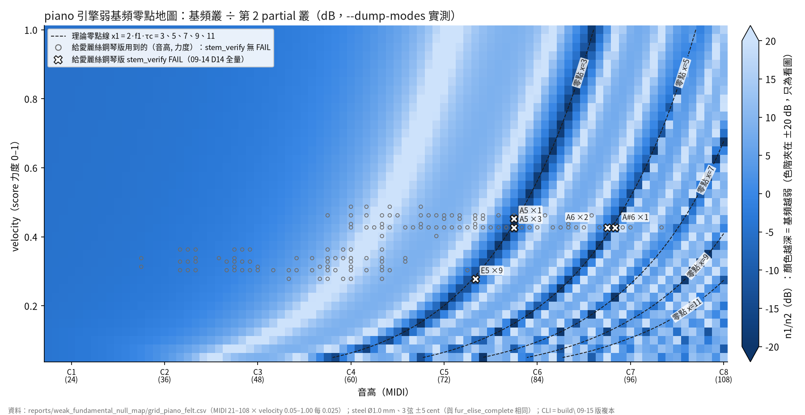
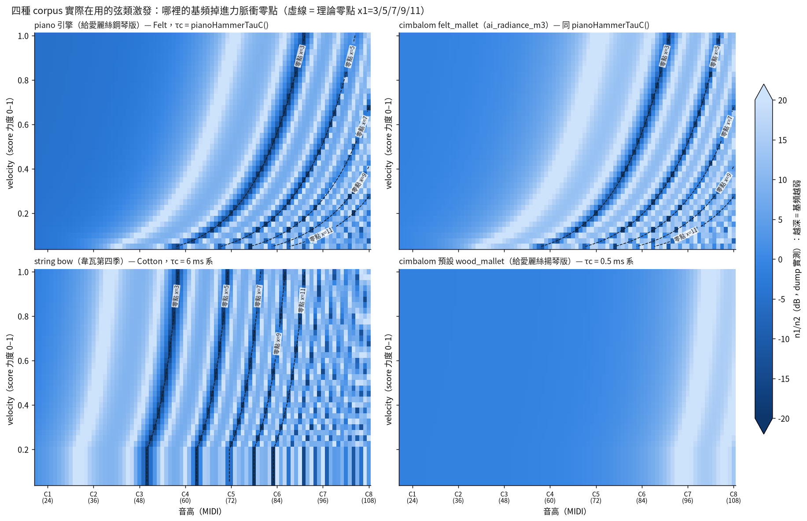
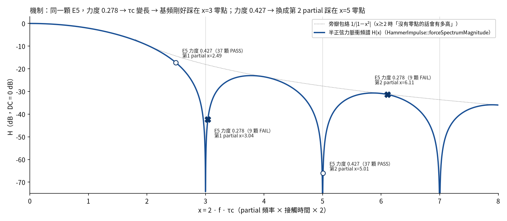
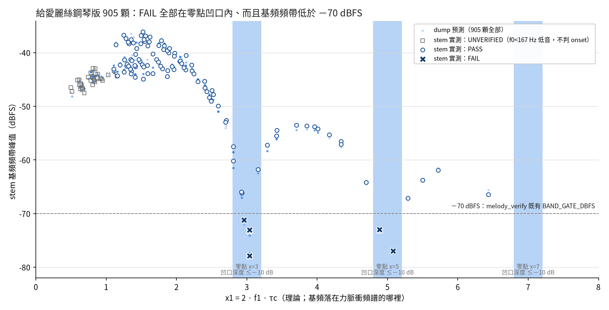

# 弱基頻「零點地圖」（TODO D16／盤點 N1-fe16）

> 產出：2026-09-25，WF0925 研究 lane 卡 N1。**不改 src/、tools/、tests/、任何 score**；只讀、只算、只渲染到 `output/wf0925/N1/`（gitignored）。
> 分析對象：`build\` 的 CLI（2026-09-15 02:07 build，sha256 `9123db8f…`）複製成 `output/wf0925/N1/cli.exe` 後使用。
> 這顆 binary 對 8 首代表曲 8/8 位元不變（對 `reports/gate_outputs/b6_method/sha256_before_post_a14.txt`），
> 而且**就是 clean_batch2 給愛麗絲鋼琴版母帶的渲染器**（母帶 `.render.json` 的 `renderer_executable_sha256` 同為 `9123db8f…`，score sha256 也相同）。
> 證據：`reports/gate_outputs/wf0925_N1_*.txt`；資料、圖、腳本：`reports/weak_fundamental_null_map/`。
> 本報告裡所有「−10 dB」之類的分界都是**描述用、非 GATE**；唯一拿來對照判定的門檻是 `tools/melody_verify.py` 既有常數 `BAND_GATE_DBFS = −70 dBFS`，本卡沒有新增或修改任何門檻。

---

## §0 白話結論卡

**一句話**：給愛麗絲那 16 顆弱基頻 FAIL，全部都是同一件事——鋼琴槌的力脈衝頻譜有幾個「洞」（零點），
這 16 顆音的基頻剛好掉進洞裡。洞的位置由「音高 × 接觸時間」決定，而接觸時間又跟著力度變，
所以**同一個音換個力度就沒事，同一個力度換個音也可能出事**。現在把整張「哪個音、哪個力度會掉進洞」的地圖畫出來了。

**數字**：

| 問題 | 答案 |
|---|---|
| 16 顆 FAIL 是不是都在洞裡？ | **是，16/16**。基頻被洞額外壓掉 14.9～24.5 dB（x=3 的洞 13 顆、x=5 的洞 3 顆） |
| 在洞裡的是不是都 FAIL？ | **不是**。另有 31 顆也在洞裡（凹口深度 ≤−10 dB）但 PASS：G5@0.427×19、D#5@0.303×6、A5@0.462×3、A#5@0.427×2、G#5@0.427×1。它們的基頻也被削弱，只是還夠大聲，沒掉到 stem_verify 的 −70 dBFS 以下 |
| 那 FAIL 真正的分界是什麼？ | **基頻的絕對音量**。用 dump 振幅換算的 stem 基頻頻帶峰值，FAIL 全部 ≤ −72.1 dBFS、PASS 全部 ≥ −67.2 dBFS，−70 剛好把 677 PASS／16 FAIL 完全分開（0 誤判） |
| 地圖本身準不準？ | 理論公式和引擎 `--dump-modes` 逐格比對，piano 4,488 格最大差 0.27 dB（振幅夠大、不受 dump 小數位數影響的 4,329 格最大差 0.04 dB） |
| 真的是 A14 B-2 造成的？ | 是。同一條 τc 公式代入 A14 之前的舊版，這 16 顆的凹口深度只有 0～−11.6 dB（當時 PASS）；換成現行版變成 −14.9～−24.5 dB。反過來，08-30 那 22 顆舊 FAIL 在舊公式下深度 −23.9～−50.8 dB，現行公式下只剩 −0.9～−10.5 dB（現在 PASS） |
| 商品有哪些受影響？ | clean_batch2 的 50 個檔裡，**只有給愛麗絲鋼琴版**（`fur_elise_complete`）：在洞裡 47 顆，其中 16 顆 stem_verify FAIL。**給愛麗絲揚琴版 0 顆、AI Radiance 五軌 0 顆、43 個音效 0 顆** |
| 商品以外 | 韋瓦第四季 12 個樂章（`string` 引擎 + `bow`，不在 clean_batch2、仍待換源）有 5,682 顆在洞裡——同一個力脈衝模型、接觸時間 6 ms 系，洞更密。另外登記，本卡不處理 |

**你要做的裁決**：給愛麗絲鋼琴版母帶怎麼辦，四個選項並列在 §6（A 帶已知限制上架／B 等 A14 B-1 文獻／C 第一原理替代脈衝研究／D 在 score 層微調 16 顆的力度）。
我**不替你選**；§6 最後附了一段標明是「建議」的看法，你可以直接略過。

---

## §1 這張地圖在回答什麼

A14 B-2 報告（`reports/a14_tauc_keytrack_before_after.md`）只在固定力度 0.45 掃了音高，沒有掃力度，
所以沒看到零點會跟著力度搬家。09-25 盤點發現給愛麗絲出現 16 顆新的弱基頻 FAIL（盤點 §2-1、APPENDIX `open-work:N1-fe16`）。
本卡把兩個軸都掃完：

1. **網格**：MIDI 21–108（88 鍵）× velocity 0.050～1.000 每 0.025（39 列），再加上 corpus 裡這種激發方式實際出現過的每一個 velocity 值。
   每一格都真的丟進 CLI 的 `--dump-modes`，讀引擎自己算出的每根弦、每個 partial 的振幅。
2. **四種 corpus 實際在用的弦類激發**都掃（全都走同一個半正弦力脈衝模型 `HammerImpulse::forceSpectrumMagnitude()`，只是接觸時間 τc 的算法不同）：

   | 設定 | 用在哪 | τc 怎麼算 | 格數 |
   |---|---|---|---|
   | `piano_felt` | 給愛麗絲鋼琴版、physical_piano | `pianoHammerTauC()`（A14 B-2 現行版） | 4,488 |
   | `cimbalom_wood` | 給愛麗絲揚琴版、月光揚琴、AI Radiance m1 | `tauCForNote()`，Wood 0.5 ms 系 | 12,936 |
   | `cimbalom_felt` | AI Radiance m3 的 16 顆 felt_mallet | 同 `pianoHammerTauC()` | 3,608 |
   | `string_bow` | 韋瓦第四季（28,376 顆） | `tauCForNote()`，Cotton 6 ms 系 | 6,776 |

   Metal（0.2 ms）只出現在少數 AI Radiance／音效事件，全 corpus 掃描（§5）直接用 dump 判斷，沒有另外畫地圖。
3. **兩個指標**（都是描述量）：
   - **n1/n2**：同一音所有弦（預設 3 弦）的第 1 個 partial 振幅相加 ÷ 第 2 個 partial 振幅相加，dB。起音瞬間各弦同相位被激發，相加就是起音時的基頻叢／第二泛音叢。
     09-25 盤點 triage 檔只看第 0 根弦，所以數字和本表差 0.5～2 dB（例：E5@0.278 盤點寫 −18.5、本表 −16.3）；兩個欄位 CSV 都有（`n1n2_s0_db` 是盤點那種算法）。
   - **凹口深度** = 20·log10|cos(π·x1/2)|，x1 = 2·f1·τc：基頻因為落在零點附近，比「沒有零點時的旁瓣高度」再低多少 dB。
     只在 x1 ≥ 2 才有意義（x=1 不是零點，`HammerImpulse.h` 檔頭已寫明）。≤ −10 dB 這個分組是**描述用、非 GATE**。

注意：**piano 引擎的低音區 n1/n2 本來就是 −5 dB 左右**，因為擊弦點固定在弦長 1/8（`sin(π/8)` 對 `sin(2π/8)` 差 5.3 dB，A14 裁決包 §3.2 已拆解）。
這不是零點造成的，所以地圖左半邊是中等深淺的藍；零點造成的是右半邊那幾條**又細又深**的斜帶。

---

## §2 地圖

### 2.1 piano 引擎（給愛麗絲鋼琴版）



- 顏色越深 = 基頻相對第二泛音越弱（色階夾在 ±20 dB，只為了看圖）。虛線是理論零點線 x1 = 3、5、7、9、11。
- 深色細帶和理論虛線完全重疊：**弱基頻只發生在零點線上**。
- 圓圈 = 給愛麗絲實際用到的（音高, 力度）組合；白色 X = stem_verify FAIL 的那幾格（E5×9、A5×3+1、A6×2、A#6×1），全部壓在 x=3 或 x=5 的零點線上。
- 規則網格 3,432 格裡：凹口深度 ≤ −10 dB 有 290 格（8.5%）；n1/n2 < −10 dB 有 95 格，而這 95 格**全部**同時落在凹口裡（沒有一格弱基頻是零點以外的原因）。最低 n1/n2 = −32.6 dB。

**查表版（piano_felt，凹口深度 ≤ −10 dB 的音；描述用、非 GATE）**：

| velocity | x=3 零點 | x=5 零點 | x=7 零點 |
|---|---|---|---|
| 0.20 | B4, C5, C#5 | C6, C#6 | G#6, A6 |
| 0.25 | C#5, D5, D#5, **E5** | D#6, E6 | B6, C7 |
| 0.30 | D#5, **E5**, F5, F#5 | F6, F#6 | C#7, D7 |
| 0.35 | F5, F#5, G5 | G6, G#6 | D#7, E7 |
| 0.40 | G5, G#5, **A5** | G#6, **A6** | F7, F#7 |
| 0.45 | G#5, **A5**, A#5 | A#6, B6 | G7 |
| 0.50 | A5, A#5, B5, C6 | B6, C7 | G#7 |
| 0.60 | B5, C6, C#6, D6 | C#7, D7 | A#7, B7 |
| 0.80 | D#6, E6, F6, F#6 | F7, F#7 | — |
| 1.00 | F#6, G6, G#6 | G#7, A7 | — |

（粗體 = 給愛麗絲 FAIL 的音。更細的列在 `grid_piano_felt.csv`，0.025 一格。力度越大 τc 越短，零點帶就往高音移。）

### 2.2 四種激發並排



- **cimbalom felt_mallet 的零點位置和 piano 完全一樣**（同一條 `pianoHammerTauC()`），只是擊弦點不同所以整體深淺不同。
  AI Radiance m3 的 16 顆（F4–F5、力度 0.42/0.46）剛好都沒踩到。
- **cimbalom wood（給愛麗絲揚琴版的預設）全圖沒有任何一格掉進零點**：τc 只有 0.5 ms 系，88 鍵最高到 C8 的 x1 都還不到 3。規則網格 3,432 格中凹口 ≤−10 dB 與 n1/n2 <−10 dB 都是 0 格。
- **string bow（Cotton 6 ms 系）零點最密**：從 C#3 附近就開始有 x=3 的洞，往上每隔幾個半音一條；velocity < 0.2 時 τc 的力度修正被 clamp 住（`tauCForStrike()` 的 [0.8, 1.2]），所以下緣變成直條。規則網格裡 531 格在凹口內、179 格 n1/n2 <−10 dB。

---

## §3 機制（為什麼同一個 E5，力度 0.278 會壞、0.427 不會）



引擎把槌子打弦的力當成一個「半正弦脈衝」，它的頻譜是

> H(x) = |cos(π·x/2)| / |1 − x²|，x = 2 × partial 頻率 × 接觸時間 τc（`HammerImpulse::forceSpectrumMagnitude()`）

分子的 cos 在 x = 3、5、7… 變成 0——這就是「洞」（x = 1 那個被分母抵消，不是洞）。每個 partial 的激發振幅都要乘上這個 H。

- **E5、力度 0.278**：τc = 2.31 ms，基頻 x1 = 3.04 → 正好踩在 x=3 的洞裡（凹口 −24.0 dB）；第二泛音 x2 = 6.11，在旁瓣頂端附近。結果基頻叢比第二泛音叢低 16.3 dB。
- **E5、力度 0.427**：力度大一點 → τc 短一點（1.89 ms）→ x1 = 2.49，基頻還在洞前面；反而是第二泛音 x2 = 5.01 踩進 x=5 的洞。結果基頻叢比第二泛音叢**高** 39.5 dB（只看第 0 根弦是 +44.8 dB，盤點引用的是這個）——這就是盤點看到「同一個 E5 換個力度就沒事」的原因。
- τc 對力度的關係來自 B4 的氈槌接觸律 `g(note,v)/g(note,0.5)`（E5 附近 τc ∝ v^−0.46），對音高的關係來自 A14 B-2 的 `keytrackScale()`（τc ∝ f^−0.32，所以 x1 ∝ f^0.68）。兩者合起來決定洞落在地圖的哪條斜線上。

**地圖和引擎一致嗎**：本卡的 `null_map_lib.py` 是 `HammerImpulse.h`、`ScoreRenderer.h` exciter 對照、`StringModel.h` 擊弦點因子、`CimbalomEngine.h` spectralTilt 的逐行 Python 鏡像，
用它算的「理論 n1/n2」和 dump 實測逐格比：

| 設定 | 格數 | 理論 − dump，全部格最大差 | 振幅 ≥ 0.0005 的格最大差（dump 只印到小數 5 位） |
|---|---|---|---|
| piano_felt | 4,488 | 0.271 dB | 0.041 dB（4,329 格） |
| cimbalom_wood | 12,936 | 0.027 dB | 0.011 dB（12,922 格） |
| cimbalom_felt | 3,608 | 0.144 dB | 0.036 dB（3,508 格） |
| string_bow | 6,776 | 0.233 dB | 0.063 dB（5,872 格） |

所以地圖上的每一條深色帶都可以用這條公式解釋，沒有其他未知原因。

**A14 B-2 把洞搬家的直接證據**（同一條公式只換 τc 版本，頻率用現行 dump）：

| 音@力度 | 顆數 | A14 之前（B4）x1／凹口 | 現行（B-2）x1／凹口 | 08-30 判定 → 09-14 判定 |
|---|---|---|---|---|
| G5@0.427 | 19 | 2.983／**−31.2 dB** | 2.807／−10.5 dB | FAIL → PASS |
| D7@0.462 | 1 | 7.027／**−27.4 dB** | 5.720／−0.9 dB | FAIL → PASS |
| G6@0.462 | 1 | 4.998／**−50.8 dB** | 4.342／−1.3 dB | FAIL → PASS |
| F#6@0.427 | 1 | 4.959／**−23.9 dB** | 4.338／−1.3 dB | FAIL → PASS |
| E5@0.278 | 9 | 3.170／−11.6 dB | 3.040／**−24.0 dB** | PASS → FAIL |
| A5@0.452 | 1 | 3.183／−10.9 dB | 2.957／**−23.5 dB** | PASS → FAIL |
| A5@0.427 | 3 | 3.270／−7.7 dB | 3.038／**−24.5 dB** | PASS → FAIL |
| A6@0.427 | 2 | 5.702／−1.0 dB | 4.885／**−14.9 dB** | PASS → FAIL |
| A#6@0.427 | 1 | 5.974／−0.0 dB | 5.082／**−17.9 dB** | PASS → FAIL |

A14 B-2 讓高音的 τc 變短，所有音的 x1 往下移一點：原本卡在洞裡的 22 顆被移出來，原本在洞「右邊」一點點的 16 顆被移進去。
在洞裡（凹口 ≤−10 dB）的事件數，舊公式 44 顆、現行 47 顆——**洞沒有變少，只是換了位置**。這和 A14 裁決包 §4 的判斷一致：
只修 τc（B-2）沒辦法消滅零點，要改的是脈衝形狀本身（B-1）。

---

## §4 用 16 顆 FAIL 驗證地圖



做法：`validate_fur_elise.py` 讀 D14 全量 stem_verify 結果（`output/wf0914/D14/g2_full_report.json`，677 PASS／16 FAIL／212 UNVERIFIED），
對 905 顆逐顆算地圖指標；另外用**現行 binary 重新渲染 149 顆 stem**（每一種出現過的（音高, 力度）組合各一顆，加上 16 顆 FAIL 全部、A5@0.462 全部），
直接呼叫 `tools/stem_verify.py` 自己的渲染與判定函式（沒有改寫判定邏輯），並量出 stem 的基頻頻帶峰值。

| 檢查 | 結果 |
|---|---|
| 重新渲染的 149 顆 stem，判定是否和 D14 一樣 | **149/149 一樣**（D14 當時是 09-14 build；現行 09-15 build 判定不變） |
| 16 顆 FAIL 是否都在零點凹口內（≤ −10 dB） | **16/16**；凹口 −14.9～−24.5 dB；x1 = 2.957～5.082 |
| 16 顆 FAIL 的 n1/n2 是否都 < −10 dB | **13/16**。A6×2（−7.2 dB）、A#6×1（−6.9 dB）不是：它們在 x=5 的洞，第二泛音本身也在很低的旁瓣（x2≈10），所以「比值」不難看，但兩個都很小聲 |
| PASS 裡有沒有也在凹口內的 | **有 31 顆**：G5@0.427×19（凹口 −10.5、n1/n2 −1.3 dB）、D#5@0.303×6（−10.5／−1.2）、A5@0.462×3（−18.8／−11.0）、A#5@0.427×2（−12.0／−2.8）、G#5@0.427×1（−18.1／−10.2） |
| 真正把 PASS/FAIL 分開的量 | stem 基頻頻帶峰值：FAIL 最高 −71.2 dBFS、PASS 最低 −67.1 dBFS（實測 stem）；用 dump 振幅預測全部 905 顆：FAIL 全部 ≤ −72.1、PASS 全部 ≥ −67.2，**677/16 零誤判** |

**白話**：零點凹口是「必要條件」——FAIL 全部在洞裡；但不是「充分條件」——在洞裡的音，如果本來就夠大聲（中音域、力度較大），
基頻被削掉 10～19 dB 之後仍高於 stem_verify 的 −70 dBFS 靜音門檻，所以判 PASS。
換句話說：**地圖告訴你「哪裡的音色會被零點削薄」，−70 dBFS 告訴你「削到 stem_verify 抓得到的程度」**。
後者跟 score 的 master_volume、力度的絕對大小有關，換一首曲子就要重算；前者只跟（音高, 力度, 激發方式）有關，可以直接查地圖。

dump → stem 峰值的換算：stem 峰值 ≈ 20·log10(基頻叢振幅 × velocity) + 20·log10(0.069 × master_volume) + offset。
0.069 是 `CimbalomEngine.h` 的輸出增益（原始碼逐字），offset 由 149 顆實測 stem 校準：平均 −6.67 dB、範圍 −7.77～−5.30 dB
（這個 offset 包含 Hann 窗頻帶能量、43 ms 分析窗內的衰減等，是量出來的經驗值，**只用給愛麗絲鋼琴 stem 校準過**；其他引擎沒有校準，§5 表格有另欄標明）。
注意這個「0 誤判」是**同一批 stem 校準、同一首曲子驗證**（樣本內）；它站得住的理由是 PASS 最低（−67.2）和 FAIL 最高（−72.1）之間有約 5 dB 的空隙，比 offset 本身 2.5 dB 的散布範圍大，不是剛好擦邊分開。換到別首曲子要重新驗證。

---

## §5 全 corpus 受影響清單

`scan_corpus.py` 對 75 份 corpus score（與 `verify_score.py --all` 同一組根目錄；clean_batch2 的 50 個商品 score 全部在內）
逐份跑 `--dump-modes`，只看走半正弦力脈衝的弦類引擎（string／cimbalom／piano，共 32,762 顆）。
tongue_drum／water_gong／custom／fm 的模態不是弦的整數倍泛音，「第 1／第 2 partial」意義不同，不在本卡範圍。

| 範圍 | 弦類事件 | 凹口 ≤ −10 dB | n1/n2 < −10 dB |
|---|---|---|---|
| **商品：給愛麗絲鋼琴版** `fur_elise_complete` | 905 | **47** | **17** |
| 商品：給愛麗絲揚琴版 `fur_elise_complete_cimbalom` | 905 | 0 | 0 |
| 商品：AI Radiance 全曲＋四樂章（全曲是四樂章疊層，同一批事件） | 136＋32＋72＋16＋16 | 0 | 0 |
| 商品：43 個世界觀音效 | 14（其餘不是弦類引擎） | 0 | 0 |
| 非商品：韋瓦第四季 12 樂章（`string` + `bow`） | 28,376 | **5,682** | 2,127 |
| 非商品：其他 examples（月光揚琴等） | 其餘 | 0 | 0 |

**商品受影響明細（給愛麗絲鋼琴版，全部 47 顆）**——時間是 score 時間（母帶 `masters/` 以同一時間軸渲染：`startSample = time × 48000`；
distribution 版經 loudnorm／重取樣，本卡沒有另外量它有沒有位移）：

| 音@力度 | 顆數 | stem_verify（09-14） | x1 | 凹口 | n1/n2 | stem 基頻峰值（預測） | 出現時間（秒） |
|---|---|---|---|---|---|---|---|
| **E5@0.278** | 9 | **FAIL ×9** | 3.040 | −24.0 dB | −16.3 dB | −77.4 dBFS | 16.250 17.083 17.917 63.750 64.583 65.417 118.750 119.583 120.417 |
| **A5@0.427** | 3 | **FAIL ×3** | 3.038 | −24.5 dB | −16.6 dB | −74.1 dBFS | 40.417 42.917 103.056 |
| **A5@0.452** | 1 | **FAIL ×1** | 2.957 | −23.5 dB | −15.8 dB | −72.1 dBFS | 32.396 |
| **A6@0.427** | 2 | **FAIL ×2** | 4.885 | −14.9 dB | −7.2 dB | −73.4 dBFS | 100.417 101.389 |
| **A#6@0.427** | 1 | **FAIL ×1** | 5.082 | −17.9 dB | −6.9 dB | −77.1 dBFS | 101.250 |
| A5@0.462 | 3 | PASS（邊緣） | 2.927 | −18.8 dB | −11.0 dB | −67.0 dBFS | 32.500 99.167 100.000 |
| G#5@0.427 | 1 | PASS（邊緣） | 2.920 | −18.1 dB | −10.2 dB | −66.9 dBFS | 103.194 |
| A#5@0.427 | 2 | PASS | 3.161 | −12.0 dB | −2.8 dB | −62.4 dBFS | 32.083 102.917 |
| G5@0.427 | 19 | PASS | 2.807 | −10.5 dB | −1.3 dB | −58.6 dBFS | 32.708, 38.854–43.437 之間 18 顆 |
| D#5@0.303 | 6 | PASS | 2.806 | −10.5 dB | −1.2 dB | −61.5 dBFS | 16.875 17.708 64.375 65.208 119.375 120.208 |

「邊緣」= n1/n2 也低於 −10 dB（描述用），但基頻峰值仍比 −70 dBFS 高約 3 dB。
逐顆清單：`reports/weak_fundamental_null_map/corpus_events_flagged.csv`（5,729 列，含 `product_id` 欄）；
依（檔案, 音, 力度）彙總：`corpus_flagged_by_note_velocity.csv`；每份 score 計數：`corpus_file_summary.csv`。

**韋瓦第（旁支發現，非本卡範圍）**：`bow` 在引擎裡對應 Cotton 硬度（`cimbalomExciterFromString()`："bow" → Cotton，τc 6 ms 系），
同一個半正弦脈衝模型，接觸時間長 3 倍，洞比鋼琴密很多（§2.2 左下圖）。12 個樂章 28,376 顆裡 5,682 顆在凹口內。
四季目前是 CC BY-SA 來源、待換源，不在 clean_batch2；換源重轉譜時若沿用 `bow`，會帶著同樣的問題。登記在 open_items。

---

## §6 給月月的選項（並列，不替你選）

| | A 帶已知限制上架 | B 等 A14 B-1 文獻 | C 第一原理替代脈衝形狀研究 | D score 層微調受影響音符的力度 |
|---|---|---|---|---|
| 做什麼 | 母帶不動；PRODUCT_SHEET「已知限制」補一行，並把 §5 的 16 顆時間交給聽人把關時重點聽 | 等 D10 的付費牆文獻（Hall 1988／Chaigne & Askenfelt Part II，盤點 §3-2），拿到脈衝真實形狀後改 `forceSpectrumMagnitude()` | 不等文獻，用 repo 已溯源的氈槌 F=K·δ^α、槌質量表，數值解「槌＋弦」接觸過程，得到非半正弦的力波形 | 只改 `fur_elise_complete.score.json` 裡落在洞裡的音的力度，讓 x1 離開凹口 |
| 會不會改渲染 | 不會 | 會（所有 piano／felt 事件，R10 前後對照） | 會（同左，而且是新物理主張，要另外驗證） | 會（只改這首，R10 前後對照） |
| 修到根本嗎 | 否 | 是（如果文獻給的形狀沒有深零點） | 可能是；結果未知 | 否，只繞過這一首；洞還在，以後的新曲子照樣會踩到（可以用本地圖預先避開） |
| 前提／代價 | 無；需要一行文案（exports 下的檔，不在本卡範圍） | 時程未知（付費牆文獻，盤點 §3-2 列在「等外部」）；修好後商品要重渲 | 工作量大（M～L）；A14 裁決包 §3.3 只說「真槌波形不是乾淨半正弦」，形狀本身沒有現成數字可抄，模型要自己驗證 | 屬創作層改動（改演奏力度）；要 R10 前後對照；幅度見下表 |
| 對這 16 顆的效果 | 0 | 視文獻 | 視結果 | E5/A5：n1/n2 從 −16 dB 回到約 0 dB；A6/A#6 往上調才有效 |

**選項 D 要調多少**（`option_d_velocity_table.py`，每個候選力度都實際丟進 `--dump-modes` 驗過；「離開凹口」用 −10 dB 分界，**描述用、非 GATE**；
響度變化只算力度線性縮放那部分）：

| 音@原力度（顆數） | 往下 | 往上 |
|---|---|---|
| E5@0.278（9，FAIL） | 0.248（−1.0 dB）→ n1/n2 −0.2、預測峰值 −65.4 | 0.334（+1.6 dB）→ n1/n2 −0.4、預測峰值 −60.0 |
| A5@0.427（3，FAIL） | 0.381（−1.0 dB）→ +0.2、−61.6 | 0.510（+1.5 dB）→ −0.5、−56.4 |
| A5@0.452（1，FAIL） | 0.381（−1.5 dB）→ +0.2、−61.6 | 0.510（+1.1 dB）→ −0.5、−56.4 |
| A6@0.427（2，FAIL） | 0.375（−1.1 dB）→ +5.9、**−70.6（仍低於 −70）** | 0.444（+0.3 dB）→ −2.0、−67.6 |
| A#6@0.427（1，FAIL） | 0.406（−0.4 dB）→ +7.6、**−69.9（貼線）** | 0.480（+1.0 dB）→ −2.2、−67.1 |
| A5@0.462（3，邊緣 PASS） | 0.381（−1.7 dB） | 0.510（+0.9 dB） |
| G#5@0.427（1，邊緣 PASS） | 0.350（−1.7 dB） | 0.469（+0.8 dB） |

（完整 10 組含 G5／D#5／A#5：`option_d_velocity_candidates.csv`。「預測峰值」是 §4 的 dump 換算值，單位 dBFS。）
要點：E5／A5 調 1～1.6 dB 就能離開凹口（n1/n2 回到約 0 dB）；A6／A#6 在 x=5 的洞附近整體音量就小，往下調反而還貼著 −70，要往上調。
離開凹口後仍在 −10 dB 分界的邊上（凹口 −9.8～−10.0 dB），不是遠離。

**建議（這一段是我的看法，不是結論，可以略過）**：
給愛麗絲鋼琴版可以先走 **A**——16 顆佔 905 顆的 1.8%，已知時間點，而且 clean_batch2 本來就建議找一位聽人把關，這 16 顆（加上 A5@0.462、G#5@0.427 兩組邊緣）正好是要他重點聽的地方；
同時把 **B** 當成真正的修法留著。如果聽人說這幾顆聽得出怪，再對這一首做 **D**（改動小、可逆，但要走 R10）。
**C** 工作量大、結果不確定，建議等 B 的文獻有沒有下文再決定。另外，給愛麗絲**揚琴版完全不受影響**，如果只想先上一個沒有這個疑慮的給愛麗絲，揚琴版可以。

---

## §7 限制與沒做的事（誠實登記）

1. **聽感**：本卡沒有任何聽感主張。「基頻比第二泛音低 16 dB 聽起來會怎樣」本卡沒有量測、也沒有引用；真鋼琴高音區的量測方向見 A14 裁決包 §0／§3.9（本卡沒有重新取得原文，不另引數字）。
2. **n1/n2 用起音振幅**：沒有把各 partial 的衰減時間（T60）算進去。起音之後基頻（T60 較長）會相對變強一些，這對 stem_verify 的起音偵測不影響，但對「整顆音的平均音色」會有差。
3. **dump 的振幅只印到小數 5 位**：振幅 < 0.0005 的格子（piano 4,488 格中 159 格）比例誤差 >1%，理論 vs dump 的最大差 0.27 dB 就出現在這些格子；不影響地圖判讀。
4. **stem 峰值換算的 offset 只用給愛麗絲鋼琴 stem 校準**（149 顆）；韋瓦第、揚琴等其他設定的「預測峰值」欄只是參考，沒有校準。
5. **地圖參數**：四張地圖各用一組代表性參數（鋼琴 steel Ø1.0、揚琴 felt Ø0.58 strike 0.295、bow Ø0.55 strike 0.18）。
   零點位置只跟 τc 與基頻有關，所以換弦徑、擊弦點不會移動零點線，只會改變整體深淺；§5 的全 corpus 清單是逐份 score 用實際參數 dump 的，沒有這個近似。
6. **本卡沒有改 PRODUCT_SHEET／TODO／HANDOVER**：依規則由交接卡統一改；需要改的地方列在 open_items。
7. **工作樹現況**：本卡進行中，工作樹裡有其他 WF0925 卡同時修改的 src 檔（`HammerImpulse.h` 只改註解、`CimbalomEngine.h` 只改 plugin 端 material key）；
   本卡分析的是 09-15 的 `build\` binary，與這些未提交修改無關（`wf0925_N1_cli_provenance.txt` 附非註解變更為空的檢查）。

---

## §8 重現方式與檔案

```
# repo 根目錄；Python 3.13（numpy/matplotlib 已裝）
cp build/TsukiSynthCLI_artefacts/Release/TsukiSynthCLI.exe output/wf0925/N1/cli.exe
python reports/weak_fundamental_null_map/scan_grid.py         --cli output/wf0925/N1/cli.exe --workdir output/wf0925/N1/grid
python reports/weak_fundamental_null_map/validate_fur_elise.py --cli output/wf0925/N1/cli.exe --workdir output/wf0925/N1/fe_stems --jobs 4
python reports/weak_fundamental_null_map/scan_corpus.py        --cli output/wf0925/N1/cli.exe
python reports/weak_fundamental_null_map/option_d_velocity_table.py --cli output/wf0925/N1/cli.exe --workdir output/wf0925/N1/optd
python reports/weak_fundamental_null_map/plot_maps.py
```

| 檔案 | 內容 |
|---|---|
| `weak_fundamental_null_map/null_map_lib.py` | HammerImpulse／exciter 對照／擊弦點／spectralTilt 的 Python 鏡像與逐事件指標 |
| `weak_fundamental_null_map/scan_grid.py` → `grid_{piano_felt,cimbalom_wood,cimbalom_felt,string_bow}.csv`、`grid_summary.json` | §2 地圖資料（每格一列，dump 與理論並列） |
| `weak_fundamental_null_map/validate_fur_elise.py` → `fur_elise_events.csv`、`fur_elise_note_velocity.csv`、`fur_elise_stems.csv`、`fur_elise_validation.json` | §3、§4 |
| `weak_fundamental_null_map/scan_corpus.py` → `corpus_events_flagged.csv`、`corpus_flagged_by_note_velocity.csv`、`corpus_file_summary.csv`、`corpus_summary.json` | §5 |
| `weak_fundamental_null_map/option_d_velocity_table.py` → `option_d_velocity_candidates.csv` | §6 選項 D |
| `weak_fundamental_null_map/plot_maps.py` → `map_piano_felt.png`、`map_four_configs.png`、`fur_elise_validation.png`、`mechanism_H.png` | 圖（單一藍色系） |
| `gate_outputs/wf0925_N1_cli_provenance.txt` | CLI 複製、sha256、8/8 位元不變、商品母帶同一 binary 的證據 |
| `gate_outputs/wf0925_N1_grid_scan.txt`、`_fur_elise_validation.txt`、`_corpus_scan.txt`、`_option_d.txt`、`_plots.txt` | 各腳本的完整命令與輸出 |
